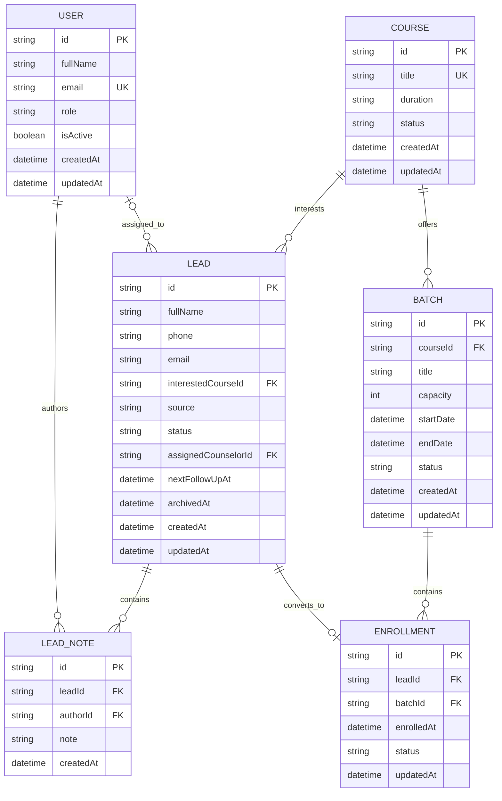

# Training Institute CRM — Relational Database Design

## Schema versus data

A database schema defines the structure, relationships, and rules of the
database.

Database data consists of the actual rows stored according to that schema.

Example:

- Schema: every lead has an ID, name, phone number, status, and course.
- Data: one particular lead named Prashant with status `NEW`.

## Core entities

The CRM uses six main entities:

1. User
2. Lead
3. LeadNote
4. Course
5. Batch
6. Enrollment

## Entity relationship diagram

## Relationship notes

- **USER → LEAD** (`assigned_to`, optional-to-many): a counselor may have many
  assigned leads; a lead may be unassigned (`assignedCounselorId` nullable).
- **USER → LEAD_NOTE** (`authors`, one-to-many): every note has exactly one
  author; a user can author many notes.
- **COURSE → LEAD** (`interests`, one-to-many): a lead expresses interest in
  exactly one course; a course can interest many leads.
- **LEAD → LEAD_NOTE** (`contains`, one-to-many): a lead can accumulate many
  timeline notes; each note belongs to one lead.
- **COURSE → BATCH** (`offers`, one-to-many): a course can run multiple
  batches (cohorts) over time.
- **LEAD → ENROLLMENT** (`converts_to`, optional one-to-one): a lead converts
  into at most one enrollment.
- **BATCH → ENROLLMENT** (`contains`, one-to-many): a batch holds many
  enrolled students, up to its `capacity`.

## Cardinality legend

| Notation | Meaning |
| -------- | ------- |
| `\|o`    | zero or one |
| `\|\|`   | exactly one |
| `o{`     | zero or many |
| `\|{`    | one or many |

## Field rules and constraints

### User

| Field | Required | Unique | Default / Rule |
| --- | --- | --- | --- |
| `id` | Yes | Yes | Generated identifier |
| `fullName` | Yes | No | Trimmed, minimum 2 characters |
| `email` | Yes | Yes | Stored in lowercase |
| `role` | Yes | No | `COUNSELOR` |
| `createdAt` | Yes | No | Current timestamp |
| `updatedAt` | Yes | No | Updated automatically |

### Lead

| Field | Required | Unique | Default / Rule |
| --- | --- | --- | --- |
| `id` | Yes | Yes | Generated identifier |
| `fullName` | Yes | No | Trimmed |
| `phone` | Yes | No | Stored in international E.164 format |
| `email` | No | No | Lowercase when provided |
| `interestedCourseId` | Yes | No | Must reference an existing course |
| `source` | Yes | No | `Website` |
| `status` | Yes | No | `NEW` |
| `assignedCounselorId` | No | No | Nullable until assignment |
| `nextFollowUpAt` | No | No | Nullable |
| `createdAt` | Yes | No | Current timestamp |
| `updatedAt` | Yes | No | Updated automatically |

### LeadNote

| Field | Required | Unique | Default / Rule |
| --- | --- | --- | --- |
| `id` | Yes | Yes | Generated identifier |
| `leadId` | Yes | No | Must reference an existing lead |
| `authorId` | Yes | No | Must reference an existing user |
| `note` | Yes | No | Must not be empty |
| `createdAt` | Yes | No | Current timestamp |

### Course

| Field | Required | Unique | Default / Rule |
| --- | --- | --- | --- |
| `id` | Yes | Yes | Generated identifier |
| `title` | Yes | Yes | Course titles should not be duplicated |
| `duration` | Yes | No | Human-readable duration |
| `status` | Yes | No | `ACTIVE` |
| `createdAt` | Yes | No | Current timestamp |
| `updatedAt` | Yes | No | Updated automatically |

### Batch

| Field | Required | Unique | Default / Rule |
| --- | --- | --- | --- |
| `id` | Yes | Yes | Generated identifier |
| `courseId` | Yes | No | Must reference an existing course |
| `title` | Yes | No | Batch display name |
| `capacity` | Yes | No | Must be greater than zero |
| `startDate` | Yes | No | Valid date |
| `endDate` | Yes | No | Must not be earlier than `startDate` |
| `status` | Yes | No | `UPCOMING` |

### Enrollment

| Field | Required | Unique | Default / Rule |
| --- | --- | --- | --- |
| `id` | Yes | Yes | Generated identifier |
| `leadId` | Yes | Yes | One lead can have only one enrollment |
| `batchId` | Yes | No | Must reference an existing batch |
| `enrolledAt` | Yes | No | Current timestamp |
| `status` | Yes | No | `ACTIVE` |

## Delete and archive behavior

### Users

A user assigned to leads or referenced by notes should not be permanently
deleted. The user should be deactivated so historical ownership and authorship
remain available.

### Leads

Leads should normally be archived instead of permanently deleted.

A future `archivedAt` field can represent soft deletion without destroying
notes, reporting data, or enrollment history.

### Lead notes

Notes belong to the lead's activity history and should not normally be edited
or deleted after creation.

If a lead is permanently removed during development or testing, its notes may
be deleted using cascading behavior.

### Courses

A course referenced by leads or batches should not be permanently deleted.

Its status should be changed to `INACTIVE`.

### Batches

A batch containing enrollments should not be deleted.

Its status should be changed to `COMPLETED` or a future archived/cancelled
status.

### Enrollments

An enrollment should not be deleted merely because a student stops attending.

Its status should be changed to `CANCELLED`.

## Business rules

- A public inquiry creates exactly one lead.
- A lead must reference an existing course.
- A counselor assignment is optional when a lead is first created.
- Only users with the `COUNSELOR` or `ADMIN` role may be assigned leads.
- Every lead note must have an author.
- A lead can be converted into an enrollment only once.
- A batch cannot accept more active enrollments than its capacity.
- A lead should normally reach `ENROLLED` status when an enrollment is created.
- Enrollment creation and lead-status updating should happen in one database transaction.
- A completed or cancelled batch should not accept new enrollments.

## Important database indexes

Indexes should later be added for fields commonly used in filtering and
searching:

- `User.email`
- `Lead.status`
- `Lead.assignedCounselorId`
- `Lead.interestedCourseId`
- `Lead.nextFollowUpAt`
- `Lead.createdAt`
- `LeadNote.leadId`
- `Batch.courseId`
- `Batch.status`
- `Enrollment.batchId`
- `Enrollment.status`

## Failure scenario review

### Scenario 1: Duplicate enrollment

**Failure**

Application code attempts to convert the same lead twice.

**Database protection**

- `Enrollment.leadId` must have a unique constraint.
- The second enrollment insert must be rejected.
- Lead conversion and enrollment creation must happen in one transaction.

**Final decision**

One lead can create at most one enrollment.

### Scenario 2: Missing counselor

**Failure**

A public inquiry is created before a counselor is available.

**Database protection**

- `Lead.assignedCounselorId` is nullable.
- When provided, it must reference an existing user.
- An invalid counselor ID must be rejected by the foreign-key constraint.

**Final decision**

A lead may temporarily remain unassigned.

Lead notes are different: every note must always have a valid author.

### Scenario 3: Deleted course

**Failure**

A course referenced by existing leads or batches is deleted.

**Database protection**

- Course deletion should use restrictive foreign-key behavior.
- The database must reject deletion while related leads or batches exist.
- The course should instead be marked `INACTIVE`.

**Final decision**

Historical courses are archived through status changes, not permanently deleted.

### Scenario 4: Full batch

**Failure**

Two counselors attempt to enroll students into the final available batch seat
at the same time.

**Database protection**

A basic application-level count is not sufficient because both requests could
read the same available capacity.

Enrollment creation must later use a database transaction with locking or
serializable isolation:

1. Read the batch and its capacity.
2. Count active enrollments.
3. Reject the operation when capacity has been reached.
4. Insert the enrollment.
5. Update the lead to `ENROLLED`.
6. Commit all changes together.

**Final decision**

Batch capacity is enforced during the enrollment transaction.

### Scenario 5: Lead deletion

**Failure**

A staff member deletes a lead that already has notes or an enrollment.

**Risk**

Permanent deletion could remove follow-up history, reporting information, and
the relationship between the original inquiry and enrollment.

**Database protection**

- Leads should use the nullable `archivedAt` field.
- Archived leads should be hidden from normal lists.
- Related notes and enrollments must remain available.
- Permanent deletion should be limited to controlled development or privacy
  workflows.

**Final decision**

Normal CRM deletion means archive, not permanent deletion.

## Database invariants

The following rules must remain true even when application code contains a bug:

- User emails are unique.
- Course titles are unique.
- Every lead references an existing course.
- A counselor reference is either null or points to an existing user.
- Every lead note references an existing lead and author.
- Every batch references an existing course.
- Batch capacity must be greater than zero.
- Batch end date cannot be earlier than its start date.
- Every enrollment references an existing lead and batch.
- One lead cannot have multiple enrollments.
- Referenced courses cannot be deleted.
- Archived leads retain their notes and enrollment history.